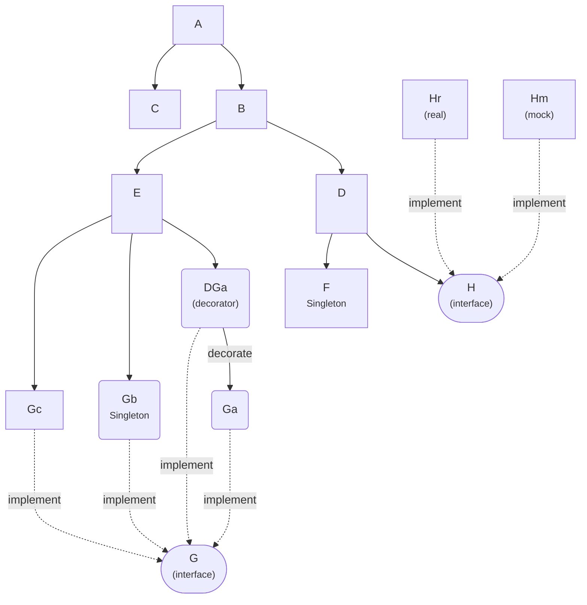

# Data Model

```mermaid
flowchart TD
A["A<br><sup></sup>"]
B["B<br><sup></sup>"]
C["C<br><sup></sup>"]
D["D<br><sup><br></sup>"]
E["E<br><sup><br></sup>"]
F["F<br><sup>Singleton</sup>"]
G(["G<br><sup>(interface)</sup>"])
Gb("Gb<br><sup>Singleton</sup>")
Ga("Ga<br><sup></sup>")
DGa("DGa<br><sup>(decorator)</sup>")
H(["H<br><sup>(interface)<br></sup>"])
Hr["Hr<br><sup>(real)</sup>"]
Hm["Hm<br><sup>(mock)</sup>"]

A-->B
A-->C
B-->D
B-->E
D-->H
D-->F
Hr -.implement..-> H
Hm -.implement..-> H
E-->DGa
E-->Gb
E-->Gc
DGa-->|decorate| Ga
Ga -.implement..-> G
Gb -.implement..-> G
Gc -.implement..-> G
DGa -.implement..-> G
```
